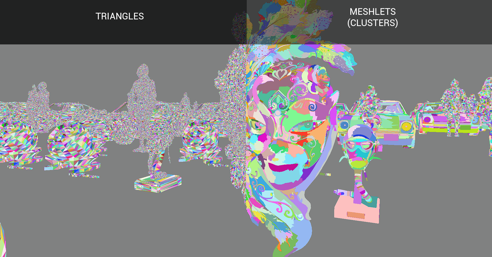

# Vulkan renderer

The toy renderer of mine where I try various rendering methods.

### The current most notable features:
- Bindless textures
- Render graph architecture:
  - Automatic resource handling
  - Automatic layout transitions
  - Resource aliasing
- GPU-driven rendering with completely GPU-side culling and indirect indexed rendering 
via `vkCmdDrawIndexedIndirectCount`
- Multilayered culling with two-phase  *HiZ* occlusion culling:
  - **Meshes** are frustum and occlusion culled
  - **Meshlets (Clusters)** are frustum, occlusion and orientation culled (orientation
  culling via bounding cone)
  - **Triangles** are frustum, orientation, small-primitive and occlusion culled.
- **Visibility buffer** as a general rendering technique. This can be seen as 
smallest possible G-Buffer with one and only render target being a 32-bit primitive + triangle IDs
  (although for deformable meshes, positions and QTangents are also necessary)
- Separate **Forward rendering** pass for translucent geometry (it also can be used as a 
main pass instead of Visibility buffer)
- Pipelines and descriptor sets creation is almost completely automated via GLSL-shader reflection
  (or rather a very small superset of GLSL with additional attributes such as
  `@dynamic` or `@bindless` and some more, but this will change in the future updates)
- Full metallic-roughness **PBR** (with IBL)
- CSM (cascaded shadow maps, still WIP)
- SSAO
- [Dear ImGui](https://github.com/ocornut/imgui) debug interface 
- CPU and GPU profiling via [Tracy profiler](https://github.com/wolfpld/tracy)

Currently, the renderer is a work in progress and is not feature-complete. 

## Requirements
- The application targets Windows desktops only
- Vulkan SDK
- GPU with Vulkan 1.3 support
- Visual Studio 2022 (or other IDE capable of loading .sln files)

## Building

This is very much a work in progress, so the building process is a bit clunky in some parts.

The solution files are generated by premake, which has a Lua problem of being
unable to work with unicode paths, so the project directory **MUST NOT** have any
special unicode characters in its path.

- Clone this repository with `--recurse-submodules`
- Run `build.bat`, this will generate .sln solution file
- There are two runnable projects inside: `VulkanRenderer` (which is the main application),
and `AssetConverter`. The main app uses its own format of asset files, which are
generated by the converter. Currently, it is managed by running a converter subprocess
in the application's entry point, which checks if there are any new/updated assets
that it needs to process. Because the conversion is rather slow
(because of heavy 3d models processing) the subprocess always
starts an optimized `Release` version of the converter. Therefore, the next step is to:
- Build `AssetConverter` in `Release` configuration
- Build and run `VulkanRenderer` in any configuration (`Release` or `Debug`)

## Running

As mentioned previously, the app uses its own file formats, so when referring to 
asset files you should always use the following extension names, regardless of 
original file extensions:
- **Shaders**: `.shader`
- **Textures**: `.tx`
- **Models**: `.model`

Finally, please note that one particular culling shader is GPU vendor-specific, 
and the application **WAS NOT** tested on NVIDIA's hardware, but the difference is
rather tiny, so it probably should be OK.

Also notice, that application is provided without any models, but the links to them
is provided at the bottom of this page. At the time of writing all
model are freely available.

## Images

### PBR + IBL
|        |           |
|---------------------------------------------|---------------------------------------------------------|
| pbr-ibl rendering with cms shadow pass | pbr-ibl rendering with emissive texture |
### Visibility buffer
The main pass rasterizes meshlet and triangle IDs to the `R32_UINT` render target.
The image below shows the content of the visibility buffer, drawn as color-converted
hashes of ids.

### Visibility rendering
After the visibility pass the main shading pass extracts all the necessary
vertex attributes and material using the rasterized id. After computing the 
barycentric coordinates and derivatives (used for texture lod selection)
attributes are interpolated and material textures are fetched. The resulting image
along with its intermediate stages is presented in the picture below.

### Multilayered culling
The left half of the picture below shows the view from the main camera. The armor on 
the foreground obscures most of the scene directly behind it as well as a part of the
flight helmet with its left shoulder. 

The right half of the picture shows the same scene
from a slightly different camera position after the culling was frozen. 
The scene is first culled on the mesh and meshlet levels before finally culling
the individual triangles. You can see most of the culling substages in action 
(except for backface culling). The tiny holes in the middle of the models are the result 
of small-primitive culling.

The triangle culling is performed in fixed batches of (visible) meshlets to make the memory usage
predictable. After culling each batch is rasterized to the visibility buffer
using a single `vkCmdDrawIndexedIndirectCount` command.

[Models used in the pictures above](./images/models.md)